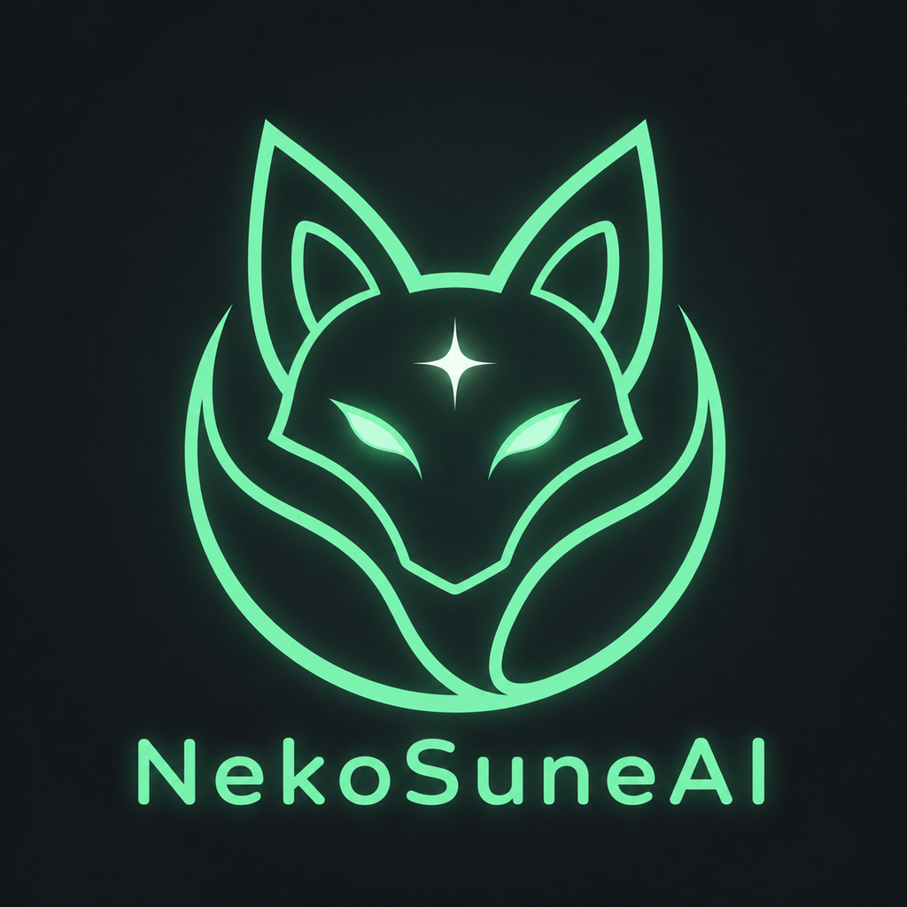

<div align="center">
  
</div>

# NekoSuneAI

### *Your brutally honest AI companion that actually talks back.*

[](https://python.org)
[](LICENSE)
[](VERSION)
[](https://microsoft.com)

NekoSuneAI is a voice-powered desktop companion built with Python. It listens through your mic, thinks with local or cloud LLMs, and speaks back with a cloned voice — all wrapped in a slick dark-themed UI.

Think Alexa, but with *attitude* and zero cloud lock-in. 🔥

---

## ✨ Features at a Glance

| | Feature | Details |
|---|---------|---------|
| 🧠 | **LLM Chat** | Ollama, OpenAI, OpenRouter, LM Studio, or the Claude/Codex CLI — your pick |
| 🎙️ | **Voice Input** | Local `faster-whisper` STT — no audio leaves your machine |
| 🔊 | **Voice Output** | XTTS-v2 streamed synthesis with cloned voices (or Google TTS lite) |
| 🧬 | **Memory / Learning** | RAG long-term memory — remembers facts across sessions and gets better |
| 🎮 | **VRChat Integration** | Plays/hangs out in VRChat via the official OSC API — walk, look, chat, emote, greet people by name, and *see* the world through an optional vision model |
| 👁️ | **Watch & React** | NekoSuneAI periodically glances at your screen (game/video) and reacts live in-character |
| 🌐 | **Per-language Voice** | Auto-detects each reply's language and speaks it in that language (Japanese line → Japanese voice, etc.) |
| 🎤 | **Singing** | Sings songs in its own voice over an auto-found YouTube instrumental |
| 🌐 | **Web Search** | Manual or auto-triggered lookups via SearXNG / DuckDuckGo |
| 🎵 | **Music** | SoundCloud search, in-app playback |
| 👤 | **Profiles** | Multiple companion personalities — create, clone, switch, import/export, delete |
| ⚡ | **Auto-Tune** | Detects your hardware, adjusts models and GPU usage |
| 🔄 | **Self-Update** | Checks GitHub for new versions on startup |
| 🗄️ | **SQLite Storage** | Everything in one clean database — no scattered JSON |

---

## 🚀 Quick Start

### ⚡ One-Line Install (fresh machine)

**Windows** — open PowerShell and paste:

```powershell
powershell -c "irm https://raw.githubusercontent.com/NekoSuneProjects/NekoSuneAI/main/install.ps1 | iex"
```

**Linux** — open a terminal and paste:

```bash
curl -fsSL https://raw.githubusercontent.com/NekoSuneProjects/NekoSuneAI/main/install.sh | bash
```

> Both installers handle **everything** — Python, LLM provider choice (Ollama, OpenAI, OpenRouter, LM Studio, or any custom endpoint), model downloads, NVIDIA GPU setup, and a desktop shortcut/launcher — the works. Just answer a few questions and sit back.

### 📦 Prefer a packaged installer?

Every [tagged release](https://github.com/NekoSuneProjects/NekoSuneAI/releases) also
ships a Windows `.exe` installer and Linux `.deb`/`.rpm`/`.apk` packages (full voice
stack bundled, no separate Python setup needed) — grab one from the Releases page, or
once published, `apt install`/`dnf install`/`apk add nekosuneai` via the shared
[NekoSuneProjects/packages](https://nekosuneprojects.github.io/packages/) repo.

### 🔧 Already have the repo?

```bash
python setup.py          # or python3 on Linux
```

First run does the full setup, then launches the desktop GUI (or terminal mode on a
headless machine). Subsequent runs skip straight to launch.

### 📋 All commands

```bash
python setup.py              # Setup (if needed) + launch (GUI, or terminal if headless)
python setup.py --launch     # 🖥️ Launch desktop GUI
python setup.py --terminal   # ⌨️ Terminal mode
python setup.py --setup      # 🔧 Re-run setup only
python setup.py --update     # 🔄 Check for updates

python app.py --gui          # 🖥️ Same desktop GUI, started directly
python app.py                # ⌨️ Terminal mode, started directly
```

---

## 🖥️ The Desktop GUI

NekoSuneAI runs as a native desktop window powered by **pywebview + Tailwind CSS** — a proper web-rendered UI that looks and feels modern, not some grey widget nightmare.

| Page | What It Does |
|------|-------------|
| 📊 **Dashboard** | Session controls, toggle voice/mic/hands-free/media (all persist across restarts), live status |
| 💬 **Chat** | Full conversation view with text + voice input |
| 🎮 **Game** | Configure the VRChat OSC connection, set a goal, watch it play |
| 🎤 **Sing** | Type a song, attach/auto-find a backing track, replay saved songs |
| 👤 **Profiles** | Create, clone, switch, delete, or import/export personalities |
| ⚙️ **Settings** | Audio devices, web search, LLM/TTS/STT config |

> 💡 **Pro tip:** Voice replies, hands-free mode, and mic mute can all be toggled *before* starting a session. Configure everything first, then hit Start.

---

## 🧬 Beyond Chat

NekoSuneAI can do far more than chat — it remembers, plays VRChat, watches your screen, and sings. Everything below is **local-first** and tuned to run on a modest 6–8GB GPU (with cloud/CLI fallbacks where it matters).

### 🧬 Memory / Learning (RAG)

NekoSuneAI **remembers across sessions** using retrieval-augmented memory — not fine-tuning. Tell it a fact today, ask for it next week, and it recalls it.

- Local **sentence-transformers** embeddings on CPU by default (keeps VRAM free for the LLM); Ollama or OpenAI embedding backends optional
- Stored in the same SQLite DB; thumbs-up/down reinforces or de-weights memories, and stale/low-score ones are pruned automatically
- Configure in Settings → **Memory (RAG)**

### 🎮 VRChat Integration

NekoSuneAI can join you in **VRChat** via the official **OSC API** (EAC-safe — no risky web API, no GPU-hungry vision needed) and narrate its thoughts aloud as it goes.

- Walk/strafe/run/turn/look, jump, use the chatbox (with typing indicator), and trigger avatar emotes
- **Receives** avatar params (Velocity/Grounded) to notice walls + ledges
- Reads VRChat's own logs for the current world and **who's in the instance** — greets people by name
- **Sees** the room when a Vision model is set (Settings → AI Provider, e.g. an Ollama model like `llava` / `qwen2.5vl` / `moondream`, or an OpenAI-compatible multimodal chat model) — describes what's nearby every think-tick so it can react to the world, not just log/OSC data
- Long chatbox messages are automatically **paged** across multiple `/chatbox/input` sends instead of getting truncated
- Configure the OSC host/ports and log directory in the **Game** panel

#### 🤝 Friends System (opt-in, unofficial API)

A separate, **opt-in** service (Game panel → VRChat Friends) that logs into VRChat's unofficial web API to auto-accept friend requests, watch friend online/offline status live, and send a thank-you chatbox message. This is against VRChat's ToS for bots and risks the account getting flagged — use a throwaway account, not your main. Needs `pip install vrchatapi pyotp websocket-client` and credentials in Settings → VRChat Friends (`VRCHAT_USERNAME`, `VRCHAT_PASSWORD`, `VRCHAT_TOTP_SECRET` for authenticator-app 2FA). Stays completely off unless `VRCHAT_FRIENDS_ENABLED=true` and credentials are set.

### 👁️ Watch & React

NekoSuneAI can periodically glance at your screen (whatever game/video/app is open) and react live, in one short in-character line, using the same vision model as VRChat's own screen awareness. Tune the glance interval and whether it speaks aloud from the panel.

### 🎤 Singing

NekoSuneAI sings songs in its **own cloned voice**, on the beat, over a real instrumental.

- Type `Artist - Title` → it fetches **timed lyrics** (LRCLIB) and performs them
- Backing track is optional: attach a **file**, paste a **YouTube URL**, or leave it blank to **auto-find an instrumental** on YouTube
- **Vocals + backing are merged into one audio file**, saved in `audio/songs/` for instant replay
- Works with **XTTS** (timed, on-beat) or **gTTS**. Needs `pip install yt-dlp imageio-ffmpeg` for the YouTube/merge features

---

## ⌨️ Terminal Commands

For the keyboard warriors out there:

<details>
<summary>📖 Click to expand full command list</summary>

### 🗣️ Voice & Input

| Command | What It Does |
|---------|-------------|
| `/mode voice` | Hands-free mic input |
| `/mode text` | Switch back to typing |
| `/listen` or `/ask` | Capture one spoken turn |
| `/voice` | Toggle spoken replies on/off |
| `/recalibrate` | Re-tune mic noise gate |
| `/mics` | List available microphones |
| `/mic <index>` | Choose a specific mic |
| `/mic default` | Reset to system default |
| `/speakers` | List XTTS voices |
| `/speaker <name>` | Switch XTTS voice |
| `/tts` | Show current TTS provider |
| `/tts xtts` / `/tts gtts` | Switch TTS engine |

### 🌐 Web Search

| Command | What It Does |
|---------|-------------|
| `/web` | Show web search status |
| `/web on` / `/web off` | Enable/disable web search |
| `/web auto on` / `/web auto off` | Toggle auto-search for current events |
| `/web clear` | Clear queued web context |
| `/web <query>` | Search and feed results to next reply |

### 🎵 Media

| Command | What It Does |
|---------|-------------|
| `/play <query>` | Search and play music on the preferred platform |
| `/music <query>` | Search your default music platform |
| `/pause` / `/resume` / `/stop` | Playback controls |

### 👤 Profiles & History

| Command | What It Does |
|---------|-------------|
| `/profile` | Show current profile |
| `/profiles` | List all profiles |
| `/profile use <id>` | Switch profiles |
| `/name <new name>` | Rename the companion |
| `/me <name>` | Set your name |
| `/reset` | Clear conversation history |
| `/performance` | Show hardware and tuning info |
| `/exit` | Quit |

</details>

> 🗣️ **Natural language works too!** Say *"play synthwave on SoundCloud"* or *"search the web for..."* — NekoSuneAI handles it without a slash command. Say the companion's name plus a standing rule (*"NekoSuneAI, always speak to me in 0s and 1s"*) to make it stick until you say *"stop"*, and say *"reset"* or *"clear"* to cancel that **and** wipe long-term memory back to blank.

---

## 🎭 Profiles — Make It Yours

Each companion profile is deeply customisable. Go wild:

| Section | What You Can Tweak |
|---------|-------------------|
| 🏷️ **Identity** | Name, pronouns, role, relationship style |
| 💬 **Conversation** | Reply length, pacing, verbosity, formatting |
| 🎚️ **Personality Sliders** | Warmth, sass, directness, patience, playfulness, formality |
| 🚧 **Boundaries** | Roast intensity, avoided topics, safety overrides |
| 🧠 **Memory** | Likes, dislikes, personal facts, inside jokes, projects |
| 🔊 **Voice** | Speech style, delivery notes, persona keywords |
| 📜 **Custom Rules** | Hard must-follow rules and soft preferences |

Want a sarcastic best friend? A patient tutor? A no-nonsense project manager? Just create a new profile and dial the sliders. 🎛️

### 📤 Import / Export

Move a profile between machines (e.g. your **PC → Raspberry Pi**) from the **Profiles** page:

- **Export** — click **Export** on any profile to download a `*.nekosuneai-profile.json` file (saved to the device you're browsing from).
- **Import** — click **Import**, pick a `*.nekosuneai-profile.json` file, and it's added as a **new** profile (importing never overwrites an existing one).
- **Delete** — remove any non-active profile with **Delete** (you always keep at least one).

> 💡 The export file carries the whole profile — identity, sliders, memory notes, voice, and all feature data — so the imported copy behaves exactly like the original.

---

## 🗄️ Data Storage

All runtime data lives in a single **SQLite database** at `data/nekosuneai.db`:

- 💬 Chat history
- 👤 Profiles and all their feature data
- ⚙️ App state (active profile, settings)

Rendered songs live on disk in `audio/songs/` for instant replay.

> 📦 On first run, existing JSON files (`profiles.json`, `history.jsonl`) are **automatically migrated** into the database. No manual steps needed.

---

## ⚙️ Configuration

Most day-to-day settings — LLM provider/model/API key, voice, speech-to-text,
web search, memory, media, singing, RVC, VRChat friends, VRChat OSC — live in
the in-app **Settings panel** (and the **Game** panel for VRChat OSC), stored
in SQLite, live-editable with no restart. `.env` (copy `.env.example` to get
started) only covers what's still `.env`-only: startup/performance tuning,
CLI-provider paths, and low-level audio/model knobs.

<details>
<summary>📖 Click to expand the remaining .env-only settings</summary>

### 🧠 Core

| Setting | Default | Description |
|---------|---------|-------------|
| `AUTO_TUNE_PERFORMANCE` | `true` | Auto-detect hardware and tune settings |
| `AUTO_TUNE_GOAL` | `balanced` | Tuning goal: `speed`, `balanced`, or `quality` |
| `AUTO_UPDATE_CHECK` | `true` | Check GitHub for updates on startup |
| `AUTO_UPDATE_INSTALL` | `false` | Auto-install updates on launch — see the security warning in `.env.example` |

### 🤖 LLM Tuning

Provider/model/API URL/key/temperature are in Settings → **AI Provider & Models**.

| Setting | Default | Description |
|---------|---------|-------------|
| `LLM_KEEP_ALIVE` | `30m` | How long Ollama keeps the model loaded |
| `OLLAMA_NUM_PREDICT` | `1200` | Reply token budget |
| `OLLAMA_SKIP_LOCAL_SETUP` | `false` | Skip local Ollama install/start/model-pull when using an existing Ollama server (set its URL in Settings) |
| `LLM_CLI_MODEL` / `CLAUDE_CLI_PATH` / `CODEX_CLI_PATH` / `LLM_CLI_COMMAND` | *(none)* | CLI-provider executable overrides — see `.env.example` |

### 🔊 XTTS / 🎙️ Speech-to-Text Tuning

Engine, model, speaker, speed and language are in Settings → **Voice** /
**Speech-to-Text**.

| Setting | Default | Description |
|---------|---------|-------------|
| `XTTS_USE_GPU` | `true` | Use GPU for voice synthesis |
| `XTTS_STREAM_OUTPUT` | `true` | Stream audio while generating |
| `STT_USE_GPU` | `true` | Use GPU for transcription |
| `STT_BEAM_SIZE` / `STT_BEST_OF` | `5` / `5` | Whisper beam search / best-of-N sampling |
| `STT_VAD_FILTER` | `false` | Voice Activity Detection filter |

### 🔈 Audio Devices

| Setting | Default | Description |
|---------|---------|-------------|
| `MIC_DEVICE_INDEX` | *(auto)* | Pin a specific microphone |
| `SPEAKER_DEVICE_INDEX` | *(auto)* | Pin a specific speaker |

### 🎮 Game Playing / 🎤 Singing

| Setting | Default | Description |
|---------|---------|-------------|
| `GAME_ENABLED` | `false` | Enable the VRChat OSC game agent (OSC host/ports/vision model/tick are in Settings → Game) |
| `SINGING_FETCH_INSTRUMENTAL` | `true` | Auto-find a YouTube instrumental when no backing is given |

RVC (chat or singing) is lazy-imported and **not** in `requirements-voice.txt`
— it pins `numpy<=1.23.5`, conflicting with this project's `numpy>=1.24`.
Install it separately, or accept the downgrade: `pip install "rvc-python>=0.1" --no-deps`.

See [`docs/CONFIGURATION.md`](docs/CONFIGURATION.md) for the complete list.

</details>

---

## 📁 Project Layout

```
NekoSuneAI/
├── app.py                    # 🚪 Entry point
├── setup.py                  # 🔧 Setup, launch, and update — all in one
├── install.ps1               # ⚡ One-line PowerShell installer (Windows)
├── install.sh                # 🐧 One-line bash installer (Linux)
├── requirements.txt          # 📦 Python dependencies (base)
├── requirements-voice.txt    # 🎙️ Optional: mic/STT/TTS/embeddings
├── requirements-gui.txt      # 🖥️ Optional: native pywebview desktop window
├── VERSION                   # 🏷️ Current version
├── .env.example              # ⚙️ Configuration template
│
├── data/
│   ├── logo.png              # 🎨 NekoSuneAI logo
│   ├── logo.ico              # 🎨 Window icon
│   ├── nekosuneai.db         # 🗄️ SQLite database (runtime)
│   └── profile.example.json  # 📝 Example profile
│
└── nekosuneai/
    ├── launcher.py           # 🚪 CLI vs GUI routing + auto-update
    ├── webgui.py             # 🖥️ Backend API for the desktop GUI
    ├── cli.py                # ⌨️ Terminal chat loop + commands
    ├── chat.py               # 🧠 System prompt + LLM requests
    ├── engine.py             # 🧩 Shared reply seam + emotion detection
    ├── memory.py             # 🧬 RAG long-term memory store
    ├── singing.py            # 🎤 Singing engine (XTTS/gTTS + backing merge)
    ├── games/                # 🎮 Game agent + VRChat OSC driver + friends system
    ├── vision.py             # 👁️ Image understanding (VRChat screen awareness, Watch & React)
    ├── config.py             # ⚙️ Environment parsing + runtime config
    ├── database.py           # 🗄️ SQLite schema + CRUD operations
    ├── storage.py            # 💾 Profile/history API (SQLite-backed)
    ├── audio_input.py        # 🎙️ Mic capture + faster-whisper STT
    ├── tts.py                # 🔊 XTTS-v2 / gTTS synthesis + playback
    ├── media.py              # 🎵 Music platform integration
    ├── media_player.py       # ▶️ In-app audio playback (ffplay)
    ├── performance.py        # ⚡ Hardware detection + auto-tuning
    ├── updater.py            # 🔄 GitHub version check + self-update
    ├── web_search.py         # 🌐 SearXNG / DuckDuckGo search
    ├── defaults.py           # 📋 Default profile template
    ├── models.py             # 📦 Shared dataclasses
    ├── paths.py              # 📍 Path constants
    └── static/
        └── index.html        # 🎨 Tailwind CSS frontend (dashboard, GUI-only)
```

---

## 📚 Documentation

<details>
<summary>🧠 How the Chat Pipeline Works</summary>

When you send a message (text or voice), NekoSuneAI runs through this pipeline:

1. **Media check** — is it a play/music request? Handle it directly.
2. **Web search** — if enabled, check for explicit `/web` queries, inferred lookups (*"what's the weather?"*), or auto-search triggers.
3. **Memory recall** — if RAG is enabled, retrieve relevant long-term memories and inject them as context.
4. **LLM request** — build a system prompt from the active profile, attach conversation history, web context, and recalled memories, send to the LLM.
5. **Voice output** — if voice is enabled, synthesise the reply with XTTS-v2 or gTTS and play it back.
6. **Remember** — store the exchange back into RAG memory for future recall.
7. **Hands-free loop** — if hands-free mode is on, immediately start listening for the next turn.

A shared generation seam (`engine.py`) means the VRChat game agent reuses this exact pipeline. The whole thing runs in a background thread so the UI stays responsive.

</details>

<details>
<summary>🎙️ Voice & Audio Architecture</summary>

### Speech-to-Text (STT)
- Engine: `faster-whisper` (local) or Google Web Speech API
- Mic capture via `SpeechRecognition` library
- Automatic noise calibration on first listen
- Configurable silence detection, energy threshold, and VAD

### Text-to-Speech (TTS)
- **XTTS-v2** (default): local neural TTS with voice cloning, GPU-accelerated, streamed output
- **gTTS** (fallback): Google's cloud TTS — lightweight but needs internet
- Audio saved to `audio/latest_reply.wav` (XTTS) or `.mp3` (gTTS)
- Playback via `sounddevice` with configurable output device

### Audio Devices
- Mic and speaker can be pinned via `.env` or the Settings page
- `/mics` and `/speakers` commands list available devices with indices
- Recalibration re-tunes the noise gate without restarting

</details>

<details>
<summary>🗄️ Database Schema</summary>

NekoSuneAI uses SQLite (`data/nekosuneai.db`) with three tables:

**`profiles`** — one row per companion profile
```sql
profile_id   TEXT PRIMARY KEY   -- e.g. "default", "snarky-bot"
profile_name TEXT               -- display name
data         TEXT               -- full profile JSON blob
created_at   TEXT               -- ISO timestamp
updated_at   TEXT               -- ISO timestamp
```

**`history`** — one row per chat message
```sql
id        INTEGER PRIMARY KEY AUTOINCREMENT
timestamp TEXT                -- ISO timestamp
role      TEXT                -- "user", "assistant", or "system"
content   TEXT                -- message text
```

**`app_state`** — key/value settings store
```sql
key   TEXT PRIMARY KEY        -- e.g. "active_profile_id"
value TEXT                    -- the value
```

Feature data lives inside the profile JSON blob under `profile_details`, so it's saved/loaded with the profile automatically.

</details>

<details>
<summary>⚡ Performance Auto-Tuning</summary>

When `AUTO_TUNE_PERFORMANCE=true`, NekoSuneAI detects your hardware at startup and picks a performance profile:

| What It Checks | What It Adjusts |
|----------------|----------------|
| CPU core count | Request timeouts |
| Available RAM | Token budget |
| CUDA GPU presence | TTS/STT GPU acceleration |
| VRAM amount | Whisper model size, XTTS streaming settings |

**Tuning goals:**
- `speed` — smaller models, aggressive timeouts, prioritise response time
- `balanced` — sensible defaults for most hardware
- `quality` — larger models, longer timeouts, prioritise output quality

> ⚠️ Auto-tune **never** changes `XTTS_SPEED`, so your companion's voice pace stays consistent across machines.

</details>

<details>
<summary>🔄 Auto-Update System</summary>

NekoSuneAI can check for and install updates from GitHub:

1. On startup, compares local `VERSION` to the remote `VERSION` on your configured branch
2. If a newer version exists and `AUTO_UPDATE_INSTALL=true`, downloads and applies the update
3. Restarts itself with the new code

**Safety guards:**
- Git checkouts with local edits are **never** auto-updated
- Update results are cached for `AUTO_UPDATE_CACHE_SECONDS` (default: 6 hours) to avoid hammering GitHub
- Manual updates always available via `python setup.py --update`

</details>

<details>
<summary>🎵 Media</summary>

NekoSuneAI intercepts natural media requests:

- *"play synthwave on SoundCloud"* → searches and plays a track
- *"pause"* / *"resume"* / *"stop"* → controls the current stream

**Music platforms:** SoundCloud (default, with direct-stream resolution), with Spotify and Deezer as browser search options. A YouTube search/download provider is planned (see `TODO.md`).

In-app playback uses `ffplay` for resolved audio URLs.

</details>

---

## 💡 Good to Know

- 📥 **First run downloads models** — XTTS-v2 and faster-whisper grab model files on first use. `python setup.py` preloads them so you're not waiting forever.
- 🔇 **Mic mute is app-level** — it stops NekoSuneAI from listening. It doesn't touch your Windows system mic.
- 🔒 **Git-safe updates** — if NekoSuneAI detects a git checkout with local edits, self-update is skipped to protect your work.
- 💾 **Audio is always saved** — voice replies land in `audio/latest_reply.wav` even if playback fails. Useful for debugging.
- 🌍 **Works offline** — with Ollama and XTTS, the entire pipeline runs locally. Web search is optional.

---

## 🤝 Contributing

The codebase is modular by design — pick an area and dive in:

| Area | File(s) | Difficulty |
|------|---------|-----------|
| 🎙️ Voice / mic issues | `nekosuneai/audio_input.py` | Medium |
| 🧠 Personality / responses | `nekosuneai/chat.py` | Easy |
| 🔊 TTS / playback | `nekosuneai/tts.py` | Medium |
| ⌨️ Commands / app flow | `nekosuneai/cli.py` | Easy |
| 🎨 GUI frontend | `nekosuneai/static/index.html` | Easy |
| 🖥️ GUI backend | `nekosuneai/webgui.py` | Medium |
| 🗄️ Data / profiles | `nekosuneai/storage.py` + `nekosuneai/database.py` | Medium |
| 🌐 Web search | `nekosuneai/web_search.py` | Medium |
| 🎵 Media | `nekosuneai/media.py` | Medium |
| 🧬 RAG memory | `nekosuneai/memory.py` | Medium |
| 👁️ Vision (VRChat screen awareness / watch & react) | `nekosuneai/vision.py` | Medium |
| 🎮 Game agent / VRChat driver | `nekosuneai/games/` | Hard |
| 🤝 VRChat friends system | `nekosuneai/games/vrchat_friends.py` | Hard |
| 🎤 Singing | `nekosuneai/singing.py` | Medium |

PRs welcome! If you're not sure where to start, open an issue and we'll point you in the right direction. 🫡

---

## 🐧 Linux & Raspberry Pi Support

> NekoSuneAI runs on **Windows**, **amd64 Linux**, and **ARM64 / Raspberry Pi 5**.

### Run modes & install profiles

`install.sh` / `install.ps1` ask **how you want to run NekoSuneAI** and install the
right dependency set for it:

| Run mode | Installs | Good for |
|---|---|---|
| **CLI** | `requirements.txt` + `requirements-voice.txt` | Terminal chat loop, works great headless (Pi / server). |
| **GUI** | the above **+ `requirements-gui.txt`** | The native desktop window (needs a display). |

Prefer to pick the raw dependency set yourself? Use `NEKOSUNEAI_INSTALL_PROFILE`
(`minimal` / `voice` / `gui` / `full`) with `setup.py --setup`, or install manually:

```bash
pip install -r requirements.txt                            # minimal (text-only CLI)
pip install -r requirements.txt -r requirements-voice.txt  # add voice/ML
pip install -r requirements.txt -r requirements-gui.txt    # add the desktop GUI
```

> The desktop GUI's CEF backend is Windows-only; on Linux/ARM `requirements-gui.txt`
> uses your system WebView instead (`gir1.2-webkit2-4.1` on Debian/Ubuntu).

### 🍓 Raspberry Pi 5 / headless quick-start

A Pi (or any server) usually has no monitor, mic, or speakers — so run in
**CLI/terminal mode**:

```bash
git clone https://github.com/NekoSuneProjects/NekoSuneAI && cd NekoSuneAI
python3 setup.py --setup        # choose the "CLI" run mode when asked
sudo apt install ffmpeg         # optional, for audio playback later
python3 app.py                  # terminal chat, works headless over SSH
```

- On a box with no audio hardware, keep `VOICE_ENABLED=false` (the default) and set
  `INPUT_MODE=text` in `.env` so terminal mode never reaches for a microphone.
- Voice can be added later — `pip install -r requirements-voice.txt` — once you attach
  a mic/speakers. XTTS runs on CPU there, so expect it to be slow.

### ✅ Done

- [x] **Minimal install runs without torch/coqui/PortAudio** — voice/ML imports are lazy
- [x] **ARM64 / Raspberry Pi 5** — `pip install` no longer pulls Windows-only `cefpython3`
- [x] **`install.sh`** — arch/distro-aware system deps, install-profile prompt, headless detection
- [x] **`nekosuneai/tts.py`** — Linux audio playback via ffplay, ALSA/PulseAudio/PipeWire/JACK support

### 🗺️ Roadmap

- [ ] systemd service / auto-start on boot
- [ ] Test on more distros (Fedora, Arch, NixOS)
- [ ] macOS support

---

## 📄 License

NekoSuneAI is open-source software licensed under the [GNU General Public
License v3.0](LICENSE). You may use, study, fork, and modify it. If you
distribute a modified version, you must provide the corresponding source under
the same license and preserve the required legal notices.

The license does not permit anyone to claim authorship of code they did not
write or present an unofficial fork as an official NekoSuneAI release. See
[NOTICE](NOTICE) for upstream attribution and [TRADEMARKS.md](TRADEMARKS.md)
for the branding policy.

Open-source licenses cannot restrict fields of use. NekoSuneProjects does not
endorse unlawful, harmful, or abusive uses of this software; all users remain
responsible for complying with applicable law.

---

<div align="center">

Built with spite, sarcasm, and way too much caffeine ☕ by [NekoSuneProjects](https://github.com/NekoSuneProjects)

**If NekoSuneAI roasts you, that's a feature, not a bug.** 😏

</div>
